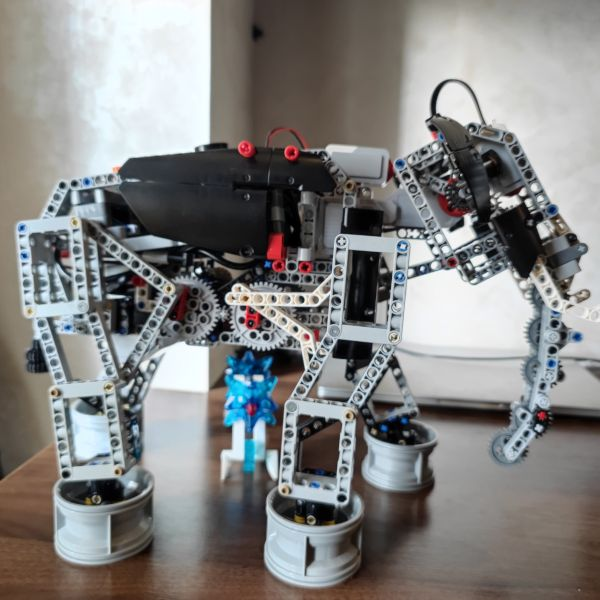
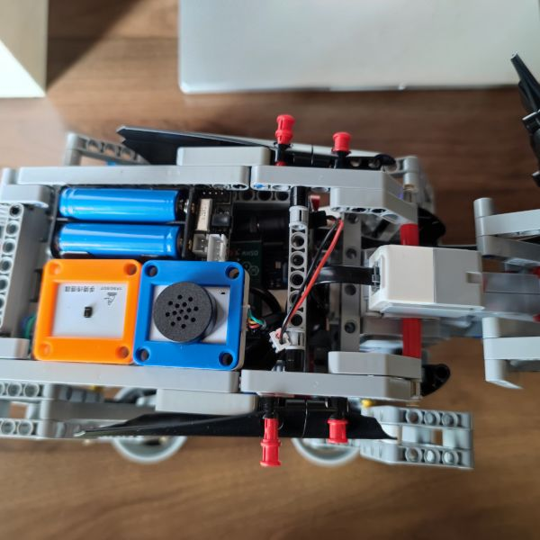
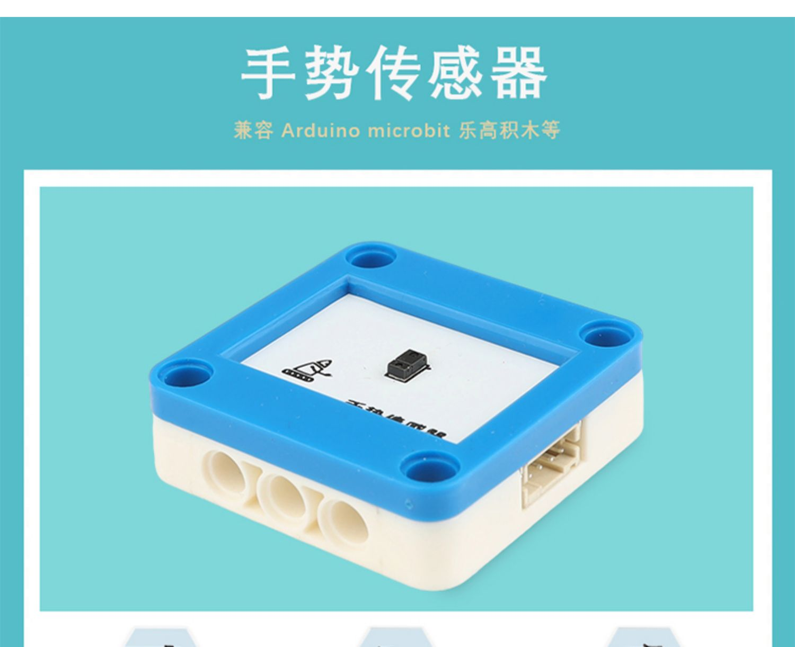
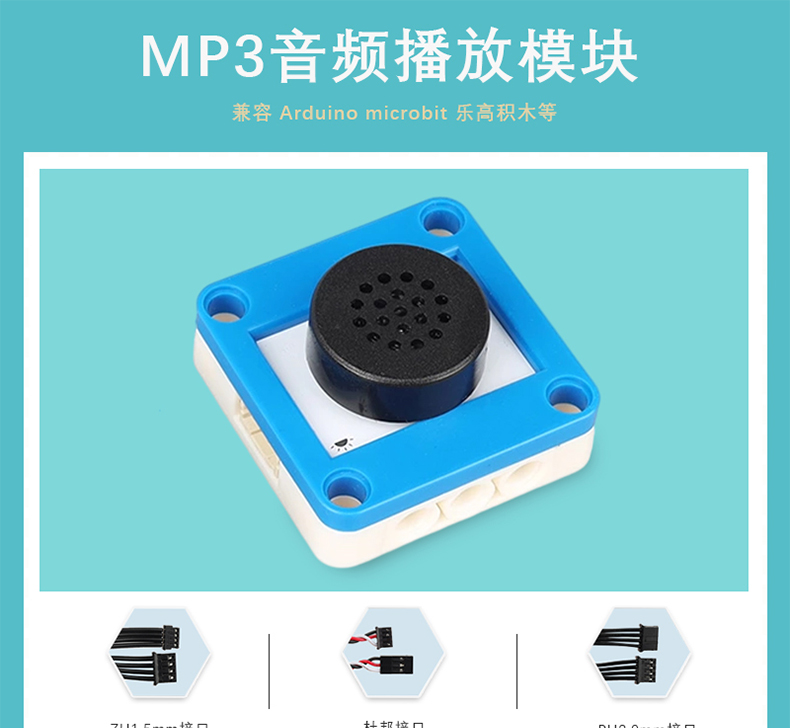

# Lego Elephant with Arduino Mega

使用开源硬件 Arduino Mega2560 替换 Lego 主控，实现官方 Elephant 案例。

## 硬件

- 主控 Arduino Mega2560
- Bricktronics Megashield 
- Sensors

| 传感器         | Port          | Jumper  | 硬件                     | desc                     |
| -------------- | ------------- | ------- | ------------------------ | ------------------------ |
| neck motor     | Motor Ports1  | -       | Lego Motor               | -                        |
| head motor     | Motor Ports2  | -       | Lego Motor               | -                        |
| walk motor     | Motor Ports3  | -       | Lego Motor               | -                        |
| gesture sensor | Sensor Ports1 | -       | YFRORBOT 手势传感器      | 连接 从 20,21 引出的 I2C |
| player sensor  | Sensor Ports2 | 2-3 4-5 | YFRORBOT MP3音频播放模块 | -                        |
| neck touch     | Sensor Ports3 | 3-4     | Lego touch sensor        | -                        |
| head touch     | Sensor Ports4 | 3-4     | Lego touch sensor        | -                        |

